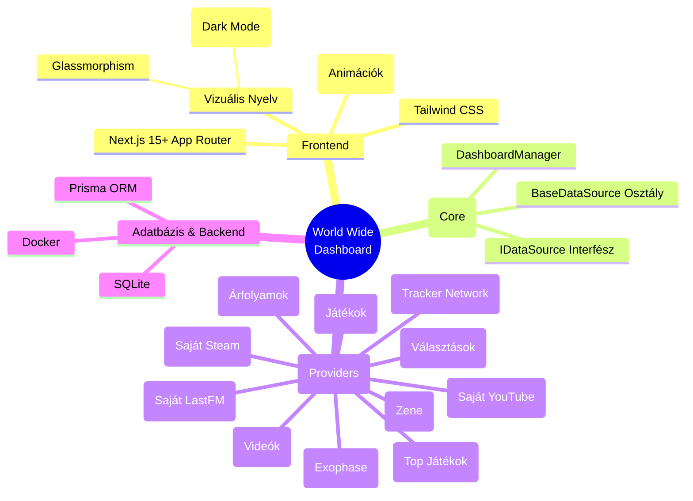

## 1. Elmetérkép (Mindmap)
A projekt teljes technológiai és funkcionális áttekintése. Jól mutatja a főbb modulokat és a használt technológiákat.

```mermaid
mindmap
  root((World Wide
    Dashboard))
    Frontend
      Next.js 15+ App Router
      Tailwind CSS
      Anime.js (Animációk)
      Vizuális Nyelv
        Glassmorphism
        Sötét Téma (Dark Mode)
    Architektúra (Core)
      DashboardManager
      IDataSource Interfész
      BaseDataSource Osztály
    Adatforrások (Providers)
      SteamProvider (Játékok)
      YouTubeProvider (Videók)
      PoliticsProvider (Választások)
      FinanceProvider (Árfolyamok)
      MusicProvider (Zene)
      TRNProvider (Tracker Network)
      ExophaseProvider (Exophase)
      SteamPersonalProvider (Saját Steam)
      LastFmPersonalProvider (Saját LastFM)
      YouTubePersonalProvider (Saját YouTube)
      SteamTopGamesProvider (Top Játékok)
    Adatbázis & Backend
      Prisma ORM
      SQLite
      Docker
```